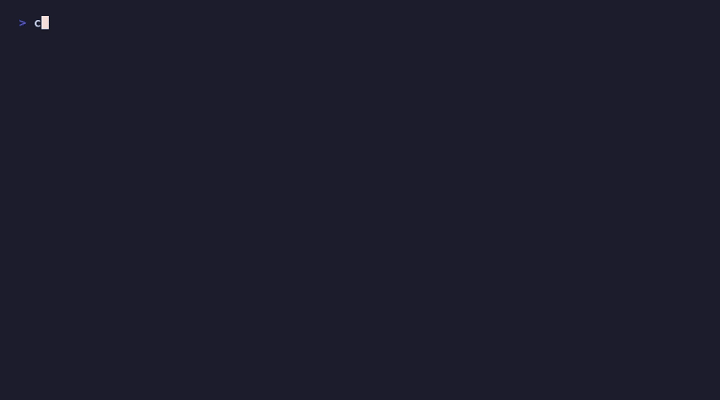

# Claude Code Kickstart

Production-grade agentic workflow template for [Claude Code](https://docs.anthropic.com/en/docs/claude-code). Drop into any project. Get session memory, sub-agents, task playbooks, and structured handoffs.



**One-line install:**

```bash
bash <(curl -fsSL https://raw.githubusercontent.com/codeverbojan/claude-code-kickstart/main/install.sh)
```

> 📖 **Read the story:** [I Built a Self-Improving Workflow for Claude Code](https://bojanjosifoski.com/i-built-a-self-improving-workflow-for-claude-code/) — the why, the four layers, and the self-improving loop that makes this different from every other CLAUDE.md template.

## The self-improving loop

This is what makes Kickstart different. Every other template is static. This one learns from its own mistakes:

```
  Mistake happens                           ┐
         │                                   │
         ▼                                   │
  PostToolUse hook captures the signal       │
  (git reverts, test/lint failures)          │
         │                                   │  Auto-loop.
         ▼                                   │  You do
  /retrospective groups signals →            │  nothing.
  appends new rules to gotchas.md            │
         │                                   │
         ▼                                   │
  SessionStart hook auto-loads gotchas       │
  at every new session                       │
         │                                   │
         ▼                                   │
  Claude avoids the same category of bug    ┘
         │
         ▼
  /metrics shows mistake rate trending down over time
```

Five hooks enforce it. `SessionStart` loads memory. `UserPromptSubmit` coaches habits. `Stop` blocks unverified "Done" claims. `PreToolUse` forces file re-reads before edits. `PostToolUse` captures mistake signals asynchronously. See [`.claude/settings.json`](.claude/settings.json) for the wiring.

## Prerequisites

- [Claude Code](https://docs.anthropic.com/en/docs/claude-code) installed:
  - macOS, Linux, WSL: `curl -fsSL https://claude.ai/install.sh | bash`
  - Windows PowerShell: `irm https://claude.ai/install.ps1 | iex`
- Git
- A project (or start fresh — click **"Use this template"** on GitHub)

## Install

**For existing projects** — run in your project root:

```bash
bash <(curl -fsSL https://raw.githubusercontent.com/codeverbojan/claude-code-kickstart/main/install.sh)
```

The installer auto-detects your stack from project files (`package.json`, `go.mod`, `Cargo.toml`, `pyproject.toml`), reads your actual commands from `package.json` scripts or `Makefile` targets, and offers framework-specific starter configs (Next.js, FastAPI, Go API, Rust CLI). You confirm and optionally add conventions — that's it.

**Update existing install** (preserves your CLAUDE.md, primer.md, gotchas.md, patterns.md, decisions.md, settings.json):

```bash
bash <(curl -fsSL https://raw.githubusercontent.com/codeverbojan/claude-code-kickstart/main/install.sh) --update
```

**Skip wizard:**

```bash
bash <(curl -fsSL https://raw.githubusercontent.com/codeverbojan/claude-code-kickstart/main/install.sh) --skip-wizard
```

**Windows:** Use WSL or Git Bash to run the installer.

**Track distribution channel** (for maintainers sharing the install link across platforms):

```bash
# Tag the install source — recorded to .claude/install-source.txt in the target project
CCK_SRC=twitter bash <(curl -fsSL https://raw.githubusercontent.com/codeverbojan/claude-code-kickstart/main/install.sh)
# or as a flag:
bash <(curl -fsSL https://raw.githubusercontent.com/codeverbojan/claude-code-kickstart/main/install.sh) --src=linkedin
```

Share one unique snippet per channel (Twitter, LinkedIn, blog post, Discord, etc.) and each installed project will carry its origin in `.claude/install-source.txt`.

Never overwrites existing files on fresh install. Safe on any project.

## Architecture: 4 Layers

```
Layer 1 — CLAUDE.md          Strict operating rules. Always loaded.
Layer 2 — Commands + Agents   Task playbooks + specialized sub-agents.
Layer 3 — Skills + Cheatsheet Domain knowledge + reference index.
Layer 4 — Memory files        primer, gotchas, patterns, decisions. Auto-loaded via hook.
```

Claude only loads what it needs. Small fixes don't pay the cost of full onboarding.

## Your First 5 Minutes

### 1. Run the installer

Auto-detects your stack and offers a matching starter config.
To fine-tune later, run `/init` or `/learn` inside Claude Code, or edit `CLAUDE.md` Section 10.

### 2. Start Claude

```bash
claude
```

Session hook auto-loads `primer.md`, `gotchas.md`, `patterns.md`, `decisions.md`, and shows git commits since the last session.

### 3. Pick a workflow

```bash
/onboard              # status check — report and wait
/onboard deep         # full context load for major work
/init                 # auto-analyze codebase, generate project config
/learn                # extract real code patterns into patterns.md
/fix login crash      # bug fix playbook
/feature user auth    # new feature playbook
/research best ORM    # research only, no code
```

### 4. End your session

```bash
/wrap-up
```

Writes a structured handoff to `primer.md`, logs decisions to `decisions.md`. Next session picks up exactly where you left off.

## What Gets Installed

```
your-project/
├── CLAUDE.md                    <- Layer 1: Operating rules (customize!)
├── primer.md                    <- Layer 4: Session state (auto-loaded)
├── gotchas.md                   <- Layer 4: Mistake log (auto-loaded)
├── patterns.md                  <- Layer 4: Code patterns (auto-loaded, populated by /learn)
├── decisions.md                 <- Layer 4: Decision log (auto-loaded, updated by /wrap-up)
├── CHEATSHEET.md                <- Layer 3: Reference index
├── .claudeignore
├── .worktreeinclude
├── .npmrc                       <- Supply chain guards (Node.js only)
└── .claude/
    ├── settings.json            <- Hooks, permissions, worktree config
    ├── mcp.json                 <- MCP servers (Playwright + Context7)
    ├── agents/                  <- Layer 2: Sub-agents
    │   ├── code-reviewer.md
    │   ├── security-reviewer.md
    │   ├── accessibility-reviewer.md
    │   ├── test-runner.md
    │   └── researcher.md
    ├── hooks/                   <- Automated behavior scripts
    │   ├── capture-signal.sh    Async — detects reverts, test failures
    │   └── habits-coach.sh      Nudges user toward good practices
    ├── commands/                <- Layer 2: Task playbooks (14 commands)
    │   ├── onboard.md           /onboard [deep] [task]
    │   ├── wrap-up.md           /wrap-up (+ metrics + decisions)
    │   ├── reset.md             /reset (wrap-up + clear + deep onboard)
    │   ├── init.md              /init (auto-analyze codebase)
    │   ├── learn.md             /learn (extract patterns)
    │   ├── retrospective.md     /retrospective (auto-generate gotchas)
    │   ├── metrics.md           /metrics (show improvement trends)
    │   ├── fix.md               /fix <bug description>
    │   ├── feature.md           /feature <feature description>
    │   ├── refactor.md          /refactor <what and why>
    │   ├── api-route.md         /api-route <endpoint>
    │   ├── research.md          /research <question>
    │   ├── test.md              /test
    │   ├── lint.md              /lint
    │   └── security-review.md   /security-review (preflight + diff audit)
    └── skills/                  <- Layer 3: Domain knowledge
        ├── securing-code/
        └── running-tests/
```

## Commands

### Session & Knowledge
| Command | Purpose |
|---------|---------|
| `/onboard` | Status check — read context, report, wait for instructions |
| `/onboard deep` | Full onboard — explore project, check health, deep report |
| `/onboard <task>` | Light onboard — focused on a task, start immediately |
| `/wrap-up` | Structured handoff — saves state + decisions + metrics for next session |
| `/reset` | Wrap up + clear context + deep onboard in one step (fresh start) |
| `/init` | Auto-analyze codebase and generate CLAUDE.md Section 10 config |
| `/learn` | Extract real code patterns into patterns.md (auto-loaded each session) |
| `/retrospective` | Analyze captured mistake signals, auto-generate new gotcha rules |
| `/metrics` | Show per-session stats and improvement trends |

### Task Playbooks
| Command | Purpose |
|---------|---------|
| `/fix` | Bug fix: trace root cause, scope, fix, verify, document |
| `/feature` | New feature: plan, build in phases, verify each phase |
| `/refactor` | Refactor: scope, delete dead code, restructure, verify |
| `/api-route` | API route: auth, validate, query, respond, security check |
| `/research` | Research only: investigate, synthesize, no code |

### Verification
| Command | Purpose |
|---------|---------|
| `/test` | Run full test suite |
| `/lint` | Run type-checker + linter + formatter |
| `/security-review` | Audit diff vs `origin/HEAD` — pre-flights git state with actionable errors |

## Sub-Agents

| Agent | Model | When Used |
|-------|-------|-----------|
| `code-reviewer` | Sonnet | After code changes (two-stage: spec compliance + quality) |
| `security-reviewer` | **Opus** | API routes, auth, inputs, supply chain |
| `accessibility-reviewer` | Sonnet | Any UI component (WCAG 2.1 AA) |
| `test-runner` | Sonnet | Before commits |
| `researcher` | Sonnet | Investigation tasks |

## Hooks (Automated Enforcement)

Three hooks enforce discipline without you having to remind Claude:

| Hook | Type | What it does |
|------|------|-------------|
| **SessionStart** | command | Loads primer.md, gotchas.md, patterns.md, decisions.md + shows git commits since last session |
| **UserPromptSubmit** | command | Habits coach — nudges user toward /onboard, playbooks, /wrap-up (shown to user, not Claude) |
| **Stop** | prompt | Verification gate — Haiku blocks Claude from claiming "Done" without showing test output |
| **PreToolUse(Edit\|Write)** | command | Injects reminder to re-read the file before editing (via `additionalContext`) |
| **PostToolUse(Bash)** | command (async) | Captures mistake signals: git reverts, test/lint/typecheck failures → `.claude/signals.jsonl` |

## Self-Improving System

The template gets smarter over time — without you doing anything:

```
PostToolUse hook captures signals automatically
  (git reverts, test failures, lint failures)
        |
        v
.claude/signals.jsonl accumulates mistake data
  (with failure snippets for root cause analysis)
        |
        v
/retrospective analyzes signals → auto-generates gotcha rules
  (grouped by type, deduplicated, confidence-scored)
        |
        v
gotchas.md grows with learned rules
  (auto-loaded every session via hook)
        |
        v
Claude avoids the same category of mistake next time
```

Run `/retrospective` periodically (weekly or after a rough session). Run `/metrics` to see if mistake rates are decreasing over time.

## How Session Memory Works

```
Session Start
  |
Hook loads: primer.md, gotchas.md, patterns.md, decisions.md
  + git commits since last session
  |
Claude knows: project state, mistakes to avoid, code patterns,
  settled decisions, what changed between sessions
  |
Work (with playbooks, sub-agents, verification)
  |
/wrap-up writes structured handoff:
  - What changed (files + reasons)
  - Uncommitted changes
  - Test status, decisions made, risks
  - Next steps + recommended command
  |
Next session resumes cleanly
```

## Updating

```bash
bash <(curl -fsSL https://raw.githubusercontent.com/codeverbojan/claude-code-kickstart/main/install.sh) --update
```

Updates agents, commands, skills, and CHEATSHEET to latest. Preserves: CLAUDE.md, primer.md, gotchas.md, patterns.md, decisions.md, settings.json, mcp.json. Your custom agents/commands are not deleted.

## Starter Configs

The installer detects your framework and offers a pre-built Section 10 config:

| Framework | Detection | Starter |
|-----------|-----------|---------|
| Next.js | `"next"` in package.json | Conventions, App Router architecture |
| FastAPI | `fastapi` in pyproject.toml | Pydantic, Alembic, async patterns |
| Go API | Router in go.mod (chi, gin, echo) | Handler/service/repo layers |
| Rust CLI | `clap` in Cargo.toml | thiserror/anyhow, clippy::pedantic |

Don't see your stack? Run `/init` after installing — it analyzes your actual codebase and generates a custom config.

## Recommended Add-ons

### SocratiCode (large codebases)

For 100k+ line projects or monorepos, add [SocratiCode](https://github.com/giancarloerra/SocratiCode) for semantic code search, dependency graphs, and context artifacts. Requires Docker.

```bash
claude plugin marketplace add giancarloerra/socraticode
claude plugin install socraticode@socraticode
```

## Key Patterns

1. **Layered architecture** — Rules / Playbooks / Reference / Memory. Only load what's needed.
2. **Auto-detection** — Installer reads project files, not just asks questions.
3. **Project intelligence** — `/learn` extracts real patterns, `decisions.md` preserves WHY.
4. **Git-aware sessions** — Hook shows commits since last session on startup.
5. **Task playbooks** — `/fix`, `/feature`, `/refactor`, `/research` — right behavior instantly.
6. **Tiered onboarding** — Bare `/onboard` = status. With task = light. With `deep` = full.
7. **Structured handoffs** — `/wrap-up` produces standard format with decisions and risks.
8. **Self-improving** — Hooks auto-capture mistakes, `/retrospective` generates gotcha rules, `/metrics` tracks improvement.
9. **Mistake memory** — `gotchas.md` grows automatically over time, auto-loaded every session.
10. **Hook enforcement** — Stop hook blocks unverified claims. PostToolUse captures failure signals async.
11. **User coaching** — Habits coach nudges users toward playbooks, onboarding, and wrap-ups.
12. **Anti-rationalization** — Playbooks explicitly block common excuses for skipping steps.
13. **Two-stage code review** — Spec compliance first, then code quality.
14. **Supply chain guards** — `.npmrc` with `ignore-scripts`, 7-day soak period, pinned versions.
15. **Updatable** — `--update` pulls latest without touching your config.

## FAQ

**Works with any language?** Yes. Language-agnostic. The installer supports Node, Python, Go, Rust out of the box. For others, run `/init` to auto-configure.

**Slows down Claude?** No. Hook loads four small files. Agents launch only when needed. Stop hook adds ~2s per response.

**Existing project?** Yes. Installer never overwrites. Copies individual files.

**Already have CLAUDE.md?** Installer skips it. Run `/init` to add Section 10, or merge manually.

**Windows?** Use WSL or Git Bash to run the installer.

**How do I update?** `bash <(curl ...) --update`. Preserves your config, updates everything else.

**Need Opus?** Only `security-reviewer` uses Opus. Everything else uses Sonnet. Change any agent's model in its `.md` file.

## Contributing

See [CONTRIBUTING.md](CONTRIBUTING.md) for how to add playbooks, starters, agents, and skills.

## License

MIT
